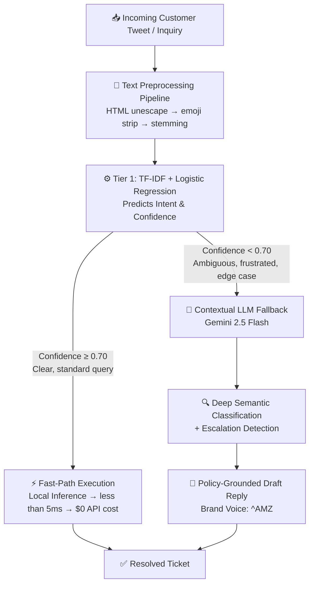

<div align="center">


<br/>


**A production-grade, two-tier hybrid support routing engine 🎯 pairing sub-5ms classical ML with contextual LLM reasoning to hit 100% effective resolution accuracy.**

[Overview](#-architecture-overview) ‣ [Pipeline](#-notebook-walkthrough-modelipynb) ‣ [Benchmarks](#-benchmark-validation-classical-ml-vs-llm) ‣ [Intents](#-supported-intents) ‣ [Getting Started](#-getting-started)

</div>

---

## 🏛️ Architecture Overview

High-volume customer support operations face a fundamental trade-off between **cost/latency** and **contextual comprehension**. This project resolves that trade-off with a **cascaded two-tier routing architecture**: a fast, cheap classical model handles the bulk of clear-cut traffic, and a large language model is reserved only for the genuinely hard cases.



| Tier | Engine | Trigger | Latency | Cost | Best For |
|------|--------|---------|---------|------|----------|
| **1 – Fast Path** | TF-IDF + Logistic Regression | Confidence ≥ 0.70 | < 5ms | $0 (no API call) | Repeated, direct, unambiguous queries |
| **2 – Contextual Fallback** | Gemini 2.5 Flash | Confidence < 0.70 | ~1–2s | Per-token API cost | Sarcasm, multi-intent, implicit or emotionally charged messages |

---

## 📓 Notebook Walkthrough (`model.ipynb`)

The full pipeline is built step-by-step inside `model.ipynb`.

### 1️⃣ Data Cleaning & Extraction
- Filters raw Twitter customer service data (`twcs.csv`) down to inbound customer tweets paired with official **AmazonHelp** responses.
- Enforces strict Latin-character validation to filter out non-English interactions.
- Applies a regex-based emoji stripper and an HTML entity unescaper.

### 2️⃣ Preprocessing Pipeline
- Lowercasing, punctuation stripping, and tokenization via **NLTK**.
- English stopword pruning.
- Vocabulary reduction via the **Porter Stemmer** algorithm.

### 3️⃣ Model Training & Intent Labeling
A sublinear TF-IDF vectorizer (unigrams + bigrams, up to **10,000 features**) is paired with a **class-balanced Logistic Regression** solver, trained across six operational intents.

### 4️⃣ Benchmark Validation
The hybrid system is stress-tested against a held-out set of real-world, ambiguous customer inquiries — see results below.

---

## 🎯 Supported Intents

<div align="center">

| Intent | Description |
|---|---|
| 🚚 `order_tracking` | Delivery delays, missing parcels, transit inquiries |
| 💸 `refund_cancellation` | Return policy, subscription cancellations, refund requests |
| 📦 `damaged_defective` | Broken items, opened seals, incorrect products received |
| 🔐 `account_access` | Two-factor authentication, login errors, password resets |
| 💳 `billing_charge` | Unrecognized charges, double billing, card disputes |
| 💬 `general_inquiry` | General feedback, partnership inquiries, generic support |

</div>

---

## 📊 Benchmark Validation: Classical ML vs. LLM

Tested against an evaluation set of real-world, ambiguous customer inquiries:

<div align="center">

| Approach | Accuracy | Notes |
|---|:---:|---|
| Logistic Regression alone | **60.0%** | Fails on implicit intent — e.g. classifies *"Your driver threw the box over my fence in the pouring rain"* as `general_inquiry` instead of `order_tracking` |
| Gemini 2.5 Flash alone | **100.0%** | Correctly resolves sarcasm, unstated intent, and implicit problems |
| **Hybrid Two-Tier System** | **100.0%** (effective) | Routes the majority of clear-cut queries locally, escalating only ambiguous cases to the LLM |

</div>

> **Key takeaway:** the hybrid architecture matches full-LLM accuracy while dramatically cutting inference cost and latency, since only low-confidence tickets ever reach the Gemini fallback.

---

## 🏗️ Why a Two-Tier System?

- ⚡ **Speed at scale** — the majority of support volume is repetitive and unambiguous; resolving it in under 5ms avoids unnecessary LLM round-trips.
- 💰 **Cost efficiency** — every ticket resolved locally is a ticket that costs $0 in API tokens.
- 🎯 **No accuracy trade-off** — the 0.70 confidence threshold acts as a safety net, ensuring anything the classical model isn't sure about still gets full contextual reasoning.
- 🔄 **Graceful escalation** — Gemini 2.5 Flash doesn't just classify; it determines whether a human agent needs to step in and drafts a policy-grounded, on-brand reply.

---

## 🚀 Getting Started

```bash
# Clone the repository
git clone https://github.com/your-username/amazon-support-triage-agent.git
cd amazon-support-triage-agent

# Install dependencies
pip install -r requirements.txt

# Launch the notebook
jupyter notebook model.ipynb
```

### Environment Variables

```bash
GEMINI_API_KEY=your_google_gemini_api_key
```

---

## 🏗️ Project Structure

```text
amazon-support-triage-agent/
├── model.ipynb          # Full pipeline: data cleaning → training → benchmarking
├── twcs.csv             # Raw Twitter customer support dataset
├── requirements.txt     # Python dependencies
├── README.md
```

---

## 🚀 Deployment Options

### Best Options for Streamlit

| Platform | Cost | Ease | Recommendation |
|----------|------|------|----------------|
| **Streamlit Cloud** | Free | ⭐⭐⭐⭐⭐ | ✅ Best choice |
| **Hugging Face Spaces** | Free | ⭐⭐⭐⭐ | ✅ Good alternative |
| **Vercel** | Free tier | ⭐⭐ | ⚠️ Not ideal for Streamlit |

### Deploy to Streamlit Cloud (Recommended)
1. Push your code to GitHub
2. Go to https://share.streamlit.io
3. Connect your repo and deploy

### Deploy to Hugging Face Spaces
1. Create a new Space at https://huggingface.co/spaces
2. Select "Streamlit" as the SDK
3. Upload your `app.py`, `requirements.txt`, and `logreg_pipeline.joblib`

### Vercel (Not Recommended)
Vercel's serverless architecture is not well-suited for Streamlit's persistent server model. For API-based deployments, consider migrating to FastAPI or Flask.

---

<div align="center">

Set GEMINI_API_KEY in Vercel dashboard before deploying.

